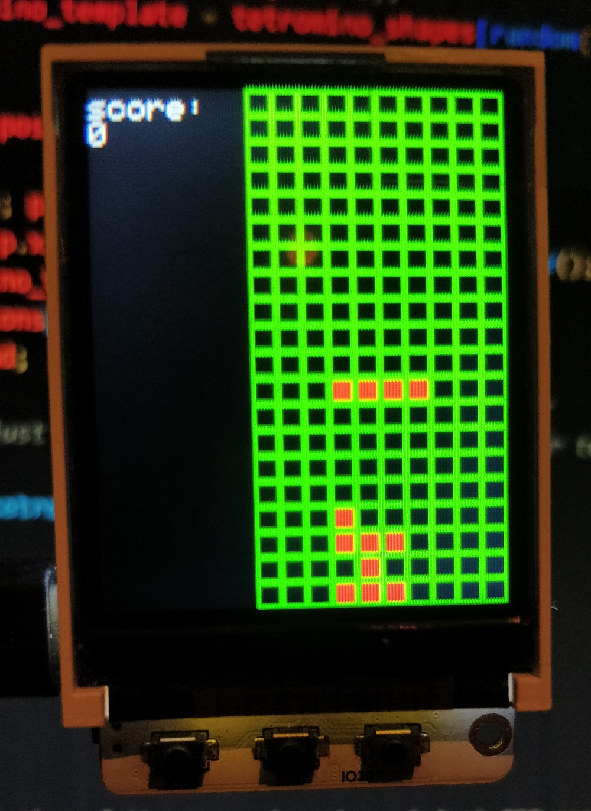

# TTGO-tetris
Tetris implemented on the TTGO-T10 1.8"

*Bad quality image of what the project looks like being used*

---
## How to play
**Playable with the buttons below the screen**
- left button moves tetromino to left
- middle button moves tetromino down
- right button moves tetromino to the right

Rotation is implemented but not accessable yet by user input. The plan is to use the builtin mpu9250 sensor to control the left and right movement and change the right and left button to rotate clockwise and counterclockwise.

## How to install
This is a very bare description but I don't expect anyone going through the effort without knowing a bit about Arduino programming. If more information is needed please submit an issue.

- Acquire a TTGO-T10 v2.0
- Install the PlatformIO extension on Visual Studio Code.
- Clone this repository
- Upload it to the TTGO-T10 device using PlatformIO.
- When all steps succes enjoy playing tetris!

## How was it written
Written in C++ using the [PlatformIO platform](https://platformio.org/).  
[TTGO library](https://github.com/Xinyuan-LilyGO/LilyGo_Txx) used for reference but changed the used display library to the Adafruit ST7735 library to not have to edit lines in the library for configuration.

